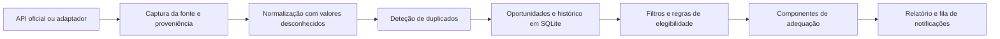

# CallBrief

**Inteligência de oportunidades de financiamento para PME e consultoras.**

CallBrief reúne avisos de financiamento, normaliza os dados que a fonte confirma e ajuda a comparar cada oportunidade com perfis reutilizáveis de organizações. O resultado inclui regras de elegibilidade, componentes de adequação, fontes e dúvidas por resolver.

**Estado:** protótipo local em desenvolvimento. Há um adaptador para a API oficial do Portal Funding & Tenders da União Europeia. Os testes usam respostas simuladas; ainda não foi recolhida uma amostra de avisos reais nem medida a qualidade da API em execução.

## O que faz

- Pesquisa avisos na API do Funding & Tenders e guarda capturas numa base de dados SQLite.
- Converte apenas campos reconhecidos para um modelo comum. Informação ausente continua desconhecida.
- Liga factos normalizados a excertos, URL, secção, intervalo de caracteres, data de recolha e hash da fonte.
- Compara identificadores e endereços canónicos para detetar duplicados. Correspondências menos seguras ficam assinaladas para revisão.
- Mantém perfis de organizações por espaço de trabalho e avaliações separadas por cliente.
- Aplica filtros configuráveis, regras determinísticas de elegibilidade, componentes de adequação, histórico de alterações e uma fila local de notificações.
- Produz relatórios Markdown ou HTML.

## Fluxo de dados



A aquisição passa por uma interface de adaptador. O motor de domínio depende de interfaces de repositório, não da base de dados SQLite nem da linha de comandos. Assim, o armazenamento pode ser substituído por uma API ou serviço mais tarde, sem implementar já uma aplicação alojada.

## Início rápido

Requer Python 3.12 ou superior. A versão básica não exige dependências externas.

```powershell
python -m venv .venv
.venv\Scripts\Activate.ps1
python -m pip install -e .
```

Ver as fontes e pesquisar avisos na fonte ativa:

```powershell
callbrief source list
callbrief discover --source eu_funding_tenders --query "SME research" --database callbrief.sqlite3
callbrief opportunity list --database callbrief.sqlite3
```

Criar um perfil e avaliar uma oportunidade guardada:

```powershell
callbrief organisation add `
  --database callbrief.sqlite3 `
  --workspace-id consultoria `
  --workspace-name "A minha consultora" `
  --id cliente-a `
  --name "Cliente A" `
  --country PT `
  --company-size PME

callbrief assess-opportunity `
  --database callbrief.sqlite3 `
  --workspace-id consultoria `
  --organisation-id cliente-a `
  --opportunity-id <ID_DO_AVISO> `
  --output avaliacao.html
```

O filtro `--region` compara a região da organização com as regiões elegíveis do aviso. O filtro `--geography` compara países ou outras geografias de candidatura. Por exemplo:

```powershell
callbrief opportunity list `
  --database callbrief.sqlite3 `
  --workspace-id consultoria `
  --organisation-id cliente-a `
  --region Norte `
  --geography Portugal
```

O comando `discover` precisa de acesso à Internet e consulta a API pública do Portal Funding & Tenders. Não corre durante os testes normais. O perfil aceita apenas os campos que o utilizador conhece; os restantes ficam vazios. As pontuações de adequação são sinais fornecidos pelo utilizador ou pela configuração, não previsões automáticas.

## Fontes e aquisição

O catálogo contém famílias de fontes portuguesas e europeias, com autoridade, jurisdição, método, periodicidade, prioridade, estado e notas de reutilização. Apenas uma família está ativa: a [API de pesquisa do Portal Funding & Tenders](https://ec.europa.eu/info/funding-tenders/opportunities/portal/screen/support/apis). A ligação está coberta por testes com respostas simuladas, mas ainda não há uma pesquisa real concluída. A documentação consultada não especifica limites de pedidos; por isso, a cadência configurada é semanal. O [aviso legal da Comissão Europeia](https://commission.europa.eu/legal-notice_en) prevê, em geral, a licença CC BY 4.0 para conteúdos da UE neste sítio Web, salvo indicação em contrário. Ainda não está confirmado se a licença se aplica aos dados devolvidos pela API; conteúdos de terceiros podem ter outras condições.

Os [termos do portal Portugal 2030](https://portugal2030.pt/termos-e-condicoes/) e os [termos do COMPETE 2030](https://www.compete2030.gov.pt/termos-e-condicoes/) proíbem copiar, alterar ou distribuir conteúdo sem autorização expressa, com a exceção de citação permitida por lei e indicação da origem. Por isso, estas fontes não têm adaptador ativo. O [conjunto de dados PT2030 em dados.gov.pt](https://dados.gov.pt/pt/datasets/dataset-pt2030-avisos) indica licença não especificada e não apresenta recursos descarregáveis. CORDIS e CINEA servem apenas para descoberta: os avisos em aberto devem ser confirmados no portal oficial. As restantes fontes permanecem desativadas até se verificarem endereços, interfaces e condições de acesso. Esta versão não implementa recolha de páginas HTML.

Agent-Reach não está disponível no ambiente local que foi inspecionado. CallBrief define o contrato `SourceAdapter` e aceita um adaptador externo por injeção. Não inclui uma implementação de recolha própria nem afirma que a ligação Agent-Reach já funciona.

## Elegibilidade e adequação

A elegibilidade tem quatro estados:

- **Elegível:** as regras conhecidas e sustentadas por evidência foram cumpridas.
- **Inelegível:** falhou pelo menos uma regra obrigatória e determinística.
- **Remediável:** existe um requisito documentado que pode ser corrigido.
- **Incerto:** faltam dados do perfil, evidência ou regras normalizadas.

Cada regra guarda os identificadores das evidências e, quando aplicável, a medida corretiva. Sem evidência correspondente, uma regra não confirma elegibilidade. A inelegibilidade determinística produz adequação geral “não aplicável”.

A pontuação expõe elegibilidade, adequação estratégica, probabilidade de sucesso, atratividade do financiamento, esforço, prazo, capacidades, consórcio, maturidade e completude da evidência. Os pesos são configuráveis num ficheiro JSON. Componentes sem pontuação ficam fora da média. Sem pelo menos um sinal de adequação, o relatório não apresenta uma pontuação global; CallBrief não estima probabilidade de sucesso sem dados validados.

Os tipos filtráveis incluem subvenções, incentivos reembolsáveis, empréstimos, garantias, incentivos fiscais, instrumentos financeiros, programas públicos e contratação pública.

## Dados, isolamento e relatórios

O SQLite guarda oportunidades comuns uma única vez, variantes por fonte, perfis por espaço de trabalho e avaliações por cliente. As consultas a perfis, avaliações e notificações de adequação incluem os identificadores do espaço de trabalho e da organização. Os avisos e respetivas alterações são dados públicos partilhados; uma notificação de adequação elevada é específica do perfil avaliado.

Os relatórios incluem critérios, componentes, evidências e perguntas em aberto. O HTML escapa conteúdo não fiável, só aceita ligações HTTPS e não executa JavaScript. A pesquisa local preserva os excertos e respetivos intervalos na fonte. A recolha de avisos ainda não cria evidência de página HTML completa, uma vez que não há adaptadores web ativos.

O comando anterior `callbrief assess` continua disponível para avaliar documentos locais com um modelo compatível com Chat Completions. Por omissão, aponta para um serviço local. O envio para um serviço remoto exige `--allow-remote`; só são enviados os excertos devolvidos pela pesquisa. Os avisos de financiamento do novo fluxo não são enviados a um modelo.

## Avaliação e resultados medidos

O conjunto de testes de recuperação compara o BM25 anterior com a pesquisa atual, que acrescenta normalização de expressões portuguesas e inglesas, siglas, sinónimos definidos e reforço de secções e nomes de ficheiro. Nas três consultas sintéticas etiquetadas, a *Recall@5* passou de **0,33 (1/3)** para **1,00 (3/3)**. Este resultado é reproduzível com `python evals/retrieval_benchmark.py`, mas não mede avisos reais.

| Medida | Resultado nesta versão | Alvo | Estado |
| --- | ---: | ---: | --- |
| Famílias oficiais com adaptador ativo | 1 | 6 a 8 | Não atingido |
| Avisos oficiais recolhidos | 0 | Pelo menos 30 | Não atingido |
| *Recall@5*, três consultas sintéticas | 1,00; anterior: 0,33 | 0,90 numa amostra etiquetada | Medido apenas em cenários sintéticos |
| Normalização, precisão de deduplicação, elegibilidade em avisos reais, validade de citações, isolamento, resistência a instruções hostis e deteção de alterações | Não medidos em amostras reais | 0,95 a 1,00, conforme a métrica | Cenários sintéticos e testes determinísticos disponíveis |
| Tempo de consulta real e tamanho de uma base com avisos recolhidos | Não medidos | Sem alvo definido | Não medido |

Os alvos são metas, não resultados. Os cenários em `evals/corpus/scenarios.json` são fictícios e cobrem elegibilidade, fontes contraditórias, duplicados, alterações, recuperação, instruções maliciosas e isolamento. Estes testes não substituem a avaliação humana de avisos oficiais.

## Verificações locais

```powershell
python -m unittest discover -s tests -v
python -m compileall -q src tests evals
python evals/retrieval_benchmark.py
```

O CI está configurado para Python 3.12, 3.13 e 3.14, além de formato, lintagem e análise de tipos com Ruff e mypy. No ambiente de desenvolvimento atual só está instalado Python 3.14; a matriz completa depende do CI.

## Limites desta versão

- Existe um adaptador de fonte oficial ativo, não os 6 a 8 previstos como meta.
- Não há uma amostra de 30 avisos reais nem uma amostra de referência revista por pessoas.
- A elegibilidade avalia regras normalizadas existentes; não interpreta automaticamente PDF ou páginas de avisos.
- O enriquecimento por NIF é apenas uma interface. Não há fornecedor ligado.
- A fila de notificações é local; não envia correio eletrónico, mensagens ou alertas externos.
- Não há interface gráfica, contas de utilizador, serviço alojado ou envio automático de candidaturas.
