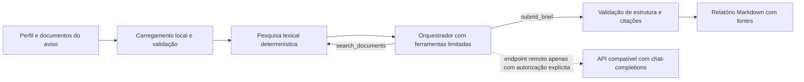

# CallBrief

**Avaliações preliminares, com fontes, de avisos de financiamento de investigação e desenvolvimento.**

CallBrief pesquisa documentos locais de um aviso e de uma entidade, e produz um resumo estruturado da adequação, dos requisitos, dos prazos e das dúvidas em aberto. Cada afirmação factual aponta para excertos que o utilizador pode confirmar.

**Estado:** protótipo funcional, com pesquisa local e avaliação por modelo. Não substitui a leitura do aviso oficial nem uma decisão jurídica ou financeira.

## Porque existe

Equipas de inovação e consultoria analisam avisos extensos e comparam critérios com informação dispersa sobre uma entidade. CallBrief torna essa primeira leitura mais rápida e rastreável: separa o que os documentos confirmam daquilo que ainda exige validação humana.

## Como funciona



O fluxo mantém o carregamento e a pesquisa no processo local. O modelo só recebe os excertos devolvidos pela pesquisa. Por omissão, a configuração aponta para um servidor local compatível com a API de chat-completions. Um destino HTTPS exige a opção explícita `--allow-remote`.

## Decisões de engenharia

- **Pesquisa primeiro, resposta depois:** o modelo não recebe a pasta inteira e tem de pesquisar antes de apresentar conclusões.
- **Ferramentas limitadas:** só pode pesquisar documentos e submeter a avaliação. Não pode executar comandos, aceder à rede ou alterar ficheiros.
- **Citações verificadas:** cada referência na resposta tem de corresponder a evidência devolvida pela pesquisa.
- **Controlo determinístico:** limites de ficheiros, tamanho, argumentos e número de turnos são aplicados pelo código, não pelo modelo.
- **Sem chamadas pagas nos testes:** os testes e os cenários de avaliação usam clientes simulados.
- **Tratamento de documentos como dados:** instruções encontradas nos documentos não são executadas. As mensagens de registo não incluem prompts, excertos nem credenciais.
- **Sem sobreposição silenciosa:** o relatório existente só é substituído com `--force` e é escrito através de substituição atómica.

## Instalação rápida

Requer Python 3.12 ou superior. A execução básica não tem dependências externas.

```bash
python -m venv .venv
# Linux ou macOS
source .venv/bin/activate
# Windows PowerShell: .venv\Scripts\Activate.ps1
python -m pip install -e .
Copy-Item .env.example .env
```

Define `CALLBRIEF_MODEL` no ficheiro `.env` e inicia um servidor de modelo local compatível. Depois:

```bash
callbrief assess --corpus examples/corpus --output avaliacao.md
```

Para usar um serviço remoto, configura `CALLBRIEF_BASE_URL`, `CALLBRIEF_MODEL` e, se necessário, `CALLBRIEF_API_KEY` no ambiente ou no ficheiro `.env`. Confirma que podes enviar os excertos e indica a autorização em cada execução:

```bash
callbrief assess --corpus ./documentos --output avaliacao.md --allow-remote
```

Os formatos suportados são Markdown e texto UTF-8. Para extrair texto de PDFs, instala a dependência opcional `python -m pip install -e ".[pdf]"`. O processamento de PDFs é local.

## Estrutura de documentos

Coloca o aviso e o perfil na pasta indicada por `--corpus`. Usa ficheiros separados para manter as fontes claras. O exemplo incluído é totalmente fictício e não representa um aviso real nem uma entidade real.

CallBrief limita o corpus a 250 ficheiros, 5 MiB por ficheiro e dois milhões de caracteres. Ignora ficheiros fora dos formatos suportados e diretórios de ambiente ou controlo de versões.

## Testes e avaliação

```bash
python -m unittest discover -s tests -v
python -m compileall -q src tests
```

Os testes cobrem pesquisa e ordenação, validação de configuração, chamadas estruturadas ao modelo, repetição limitada após HTTP 429, lista de ferramentas permitidas, citações, escrita segura do relatório e dois cenários offline. A matriz de CI executa os testes em Python 3.12, 3.13 e 3.14.

## Limites atuais

- O resultado depende da qualidade dos documentos e do modelo configurado.
- A pesquisa lexical é determinística, mas não entende conceitos que não partilhem vocabulário com os documentos; não usa uma base vetorial nem memória persistente.
- O estado “cumpre” significa apenas que há evidência textual compatível. A interpretação oficial dos critérios continua a exigir revisão humana.
- Não há interface gráfica nem serviço alojado. O projeto é uma ferramenta de linha de comandos.
