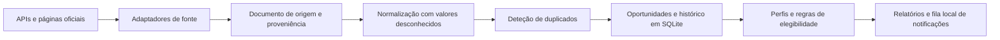

# CallBrief

**Inteligência de oportunidades de financiamento para PME e consultoras.**

CallBrief reúne avisos públicos, conserva a origem de cada facto e compara oportunidades com perfis separados de clientes. Esta versão demonstra um protótipo local com dados reais consultados em páginas oficiais, recuperação lexical, normalização explicável e armazenamento SQLite.

**Estado:** protótipo local em desenvolvimento. O registo tem quatro adaptadores oficiais ativos: a API Funding & Tenders, a API TED para contratação pública, a lista LIFE da CINEA e o XLSX do Plano Anual de Avisos Portugal 2030, que só fornece previsões. A amostra abaixo foi transcrita manualmente de páginas oficiais e não foi recolhida pelos adaptadores. A verificação final da aquisição em direto aguarda nova execução com a consulta corrigida à Funding & Tenders.

## O que demonstra

- 30 oportunidades reais, atuais ou recentes, de Portugal e de programas da União Europeia.
- 59 consultas de recuperação com rótulos manuais: 19 para calibração e 40 para validação, incluindo 12 consultas sem resposta.
- Normalização de identificadores, programas, datas, orçamento e campos de candidatura, com evidência para excertos e ligações oficiais.
- Correspondência exata testada nos cinco pares CINEA/Funding & Tenders, com dez pares negativos do corpus e um caso anual controlado. Os candidatos prováveis e possíveis ficam para revisão.
- Avaliações de elegibilidade sustentadas por um campo oficial de tipo de beneficiário, além de isolamento por espaço de trabalho e cliente.
- Regras de elegibilidade determinísticas, histórico de alterações e fila local de notificações.

## Fontes e dados

| Fonte | Cobertura | Adaptador | Reutilização comercial |
| --- | --- | --- | --- |
| [Funding & Tenders](https://ec.europa.eu/info/funding-tenders/opportunities/portal/screen/support/apis) | Subvenções e avisos de programas da UE | API de pesquisa pública; filtro JSON enviado em formulário multipart | Condições específicas dos dados da API por confirmar |
| [TED](https://docs.ted.europa.eu/api/latest/search.html) | Contratação pública, não subvenções | API de pesquisa ativa | Reutilização documentada ([aviso legal](https://ted.europa.eu/en/legal-notice)), sujeita às regras de utilização adequada |
| [CINEA, avisos LIFE 2026](https://cinea.ec.europa.eu/life-calls-proposals-2026_en) | Identificadores, programas, estados, datas e ligações para avisos LIFE | Lista e páginas de detalhe em HTML | Reutilização geral da Comissão com atribuição, salvo exceções e direitos de terceiros ([aviso legal](https://commission.europa.eu/legal-notice_en)) |
| [COMPETE 2030](https://compete2030.gov.pt/avisos/) | Avisos nacionais | Sem adaptador ativo | A reutilização automática aguarda esclarecimento dos termos |
| [Plano Anual de Avisos Portugal 2030](https://portugal2030.pt/plano-anual-de-avisos/) | Previsões de avisos futuros, nunca confirmação de abertura | Adaptador XLSX ativo, com campos selecionados e ligação à origem | Os termos do ficheiro exigem confirmação; redistribuição comercial desativada |

A API TED permite pesquisar avisos publicados e a documentação descreve utilização para análise e reutilização. A lista LIFE da CINEA encaminha para páginas de detalhe que publicam a referência oficial, o estado, as datas e a ligação direta para o Funding & Tenders. O adaptador usa a CINEA como fonte de descoberta da agência e o Funding & Tenders como registo canónico do programa. A política geral da Comissão prevê reutilização com atribuição salvo indicação em contrário ou direitos de terceiros. Isso não confirma, por si só, as condições de cada dado devolvido pela API.

O [Plano Anual de Avisos](https://portugal2030.pt/plano-anual-de-avisos/) descreve o XLSX para consulta como aberto, pesquisável e editável. A página liga o [ficheiro XLSX do plano de setembro de 2026 a agosto de 2027](https://portugal2030.pt/wp-content/uploads/sites/3/2026/09/PlanoAnualAvisos_download_140926-1.xlsx), que serve tecnicamente como fonte canónica de previsões: contém identificadores, programas e datas previstas. Não confirma que um aviso esteja formalmente aberto. Não foi localizada uma licença específica para este ficheiro. Por isso, o adaptador conserva apenas campos selecionados e a ligação à origem; a redistribuição comercial continua desativada até a AD&C esclarecer as condições. Esta decisão sobre o ficheiro não altera a política aplicada ao conteúdo geral do portal.

Os termos gerais do [Portugal 2030](https://portugal2030.pt/termos-e-condicoes/) e do [COMPETE 2030](https://www.compete2030.gov.pt/termos-e-condicoes/) restringem a cópia e distribuição de conteúdo dos respetivos portais sem autorização, salvaguardadas as exceções legais, como o direito de citação com indicação da origem. Os avisos formalmente abertos continuam sem adaptador. O conjunto [PT2030 - Avisos no dados.gov.pt](https://dados.gov.pt/pt/datasets/dataset-pt2030-avisos) tinha, na consulta de 15/09/2026, licença não especificada e nenhum recurso de dados. O portal dispõe de uma API de catálogo, mas não foi encontrado nesse conjunto um recurso ou uma API específica para os avisos abertos, nem um fluxo RSS oficial. Os documentos anexos a avisos individuais podem ter condições próprias e ainda não foram recolhidos. Estas observações não constituem certificação jurídica.

Pergunta preparada para a AD&C: «Autorizam a recolha periódica dos identificadores, títulos, datas e ligações do ficheiro XLSX do Plano Anual de Avisos e dos avisos publicados, bem como a sua apresentação num serviço externo com atribuição e ligação à fonte? Existem licenças ou condições específicas para reutilizar os ficheiros descarregáveis?»

### Agent-Reach

CallBrief implementa `AgentReachSourceAdapter` através de uma interface de ponte. A ponte tem de fornecer `fetch(query, limit)` e devolver páginas com URL, título, texto, tipo de conteúdo, ligações, metadados e hora de recolha opcionais. CallBrief valida os domínios permitidos e converte os resultados em oportunidades sem depender dos detalhes internos do Agent-Reach. Os testes de contrato usam um serviço falso; o serviço Agent-Reach não está disponível na nuvem nem faz parte do CI.

Quando a ponte estiver instalada localmente, o teste de integração é:

```powershell
python scripts/verify_agent_reach.py --allowed-host portugal2030.pt --query "avisos Portugal 2030"
```

O comando espera o módulo `agent_reach_callbrief_bridge:create_bridge`, configurável com `--factory`. O teste local real continua por executar.

### Amostra de oportunidades

O conjunto em `evals/real_opportunities.json` contém 30 registos consultados manualmente em fontes oficiais até 07/10/2026:

| Fonte | Registos |
| --- | ---: |
| COMPETE 2030 | 10 |
| Funding & Tenders | 15 |
| CINEA | 5 |

Na data de referência, a amostra contém 24 oportunidades abertas, uma futura e cinco encerradas nos últimos 90 dias. A página de `MPr-2026-6` ainda mostra 30/09/2026 numa secção, mas o [PDF oficial da republicação](https://compete2030.gov.pt/wp-content/uploads/2026/06/AVISOM3-1.pdf), datado de 30/09/2026, confirma 30/10/2026 como fim do período. O PDF limita a prorrogação indicada a candidatos com pedidos pendentes no MPr-2025-9. O registo guarda o excerto, a página do PDF e a ligação à fonte na evidência da oportunidade.

Os 30 registos manuais preservam ligações oficiais, excertos e o rótulo `MANUALLY_TRANSCRIBED`. Não têm hash das respostas originais e não foram recolhidos pelos adaptadores. Nas recolhas ao vivo, os adaptadores calculam SHA-256 da resposta em memória e associam o hash, URL e hora de recolha à evidência. O TED conserva ainda uma captura normalizada limitada a 16 KiB; as outras fontes conservam apenas campos e excertos mínimos. Os testes e documentos locais identificam-se como `CAPTURED_FIXTURE`. O hash identifica a resposta recebida, mas, sem guardar essa resposta, não permite recalculá-lo numa auditoria futura. Os rótulos foram preparados numa só passagem e não tiveram validação independente.

## Fluxo de dados



O domínio depende de interfaces e não da base de dados ou da linha de comandos. Os adaptadores mantêm os detalhes de cada fonte fora das regras de negócio. O armazenamento comum conserva variantes por fonte, para que uma correspondência não apague a origem do registo.

## Início rápido

Requer Python 3.12 ou superior. A instalação básica não exige dependências externas.

```powershell
python -m venv .venv
.venv\Scripts\Activate.ps1
python -m pip install -e .
```

Ver o catálogo, verificar a ligação a uma fonte ou pesquisar avisos:

```powershell
callbrief source list
callbrief source check eu_funding_tenders --query "SME research" --limit 10
callbrief source check portugal2030_annual_plan --limit 10
callbrief discover --source eu_funding_tenders --query "SME research" --database callbrief.sqlite3
callbrief opportunity list --database callbrief.sqlite3
```

`source check` mostra o estado HTTP, os bytes recebidos, os registos aceites e rejeitados, a validação do esquema, o intervalo de datas, a última atualização e a paginação. O workflow manual `Live source verification` verifica os quatro adaptadores num agente alojado pelo GitHub. A recolha passa quando pelo menos três fontes concluem as verificações de rede, esquema, análise dos registos, paginação e evidência de origem; o resumo identifica à parte as fontes que falham. O workflow guarda apenas um resumo compacto como artefacto e deixa o corpus normalizado no diretório temporário do agente. A recolha ao vivo serve para verificar os adaptadores e não altera a amostra de avaliação identificada.

```powershell
callbrief source check --all-active --json
```

Criar um perfil e avaliar uma oportunidade guardada:

```powershell
callbrief organisation add `
  --database callbrief.sqlite3 `
  --workspace-id consultoria `
  --workspace-name "A minha consultora" `
  --id cliente-a `
  --name "Cliente A" `
  --country PT `
  --company-size PME

callbrief assess-opportunity `
  --database callbrief.sqlite3 `
  --workspace-id consultoria `
  --organisation-id cliente-a `
  --opportunity-id <ID_DO_AVISO> `
  --output avaliacao.html
```

O filtro `--region` compara a região da organização com as regiões elegíveis do aviso. O filtro `--geography` compara países ou outras geografias de candidatura. Os campos de perfil desconhecidos ficam vazios; as pontuações de adequação dependem de sinais fornecidos pelo utilizador ou pela configuração.

## Elegibilidade e adequação

A elegibilidade tem quatro estados:

- **Elegível:** as regras conhecidas e sustentadas por evidência foram cumpridas.
- **Inelegível:** falhou pelo menos uma regra obrigatória e determinística.
- **Remediável:** existe um requisito documentado que pode ser corrigido.
- **Incerto:** faltam dados do perfil, evidência ou regras normalizadas.

Cada regra guarda os identificadores das evidências e, quando aplicável, a medida corretiva. Sem evidência correspondente, uma regra não confirma elegibilidade. A inelegibilidade determinística torna a adequação geral «não aplicável».

A pontuação apresenta componentes de adequação estratégica, financiamento, esforço, prazo, capacidades, consórcio, maturidade e completude da evidência. Os pesos são configuráveis num ficheiro JSON. Componentes sem pontuação ficam fora da média. Sem pelo menos um sinal de adequação, o relatório não apresenta uma pontuação global; CallBrief não estima a probabilidade de sucesso sem dados validados.

Os tipos filtráveis incluem subvenções, incentivos reembolsáveis, empréstimos, garantias, incentivos fiscais, instrumentos financeiros, programas públicos e contratação pública.

## Dados, isolamento e relatórios

O SQLite guarda oportunidades comuns uma única vez, variantes por fonte, perfis por espaço de trabalho e avaliações por cliente. As consultas a perfis, avaliações e notificações de adequação incluem os identificadores do espaço de trabalho e da organização. Os avisos e as respetivas alterações são partilhados; uma notificação de adequação elevada pertence ao perfil avaliado.

Os relatórios incluem critérios, componentes, evidências e perguntas em aberto. O HTML escapa conteúdo não fiável, só aceita ligações HTTPS e não executa JavaScript. Cada evidência identifica a origem como `LIVE_SOURCE_VERIFIED`, `CAPTURED_FIXTURE` ou `MANUALLY_TRANSCRIBED`, além de guardar excerto, URL e localização. Os dados manuais não se apresentam como aquisição automática.

O comando anterior `callbrief assess` continua disponível para avaliar documentos locais com um modelo compatível com Chat Completions. Por omissão, usa um serviço local. O envio para um serviço remoto exige `--allow-remote`; só seguem os excertos devolvidos pela pesquisa. O novo fluxo de avisos de financiamento não envia documentos a um modelo.

## Avaliação e resultados

O relatório reproduzível é gerado por `python -m evals.real_corpus_benchmark`. Usa os 30 registos manuais e 59 consultas: 47 com resposta relevante e 12 sem resposta. O subconjunto de desenvolvimento tem 13 consultas respondíveis e seis sem resposta. As 40 consultas de validação têm 34 respondíveis e seis sem resposta. O limiar de abstenção é escolhido apenas no subconjunto de desenvolvimento.

| Medida | Resultado | Leitura |
| --- | ---: | --- |
| Adaptadores oficiais ativos no catálogo | 4 | Funding & Tenders, TED, CINEA e Plano Anual Portugal 2030; o Plano Anual só contém previsões |
| Verificação de fontes em direto | Pendente | O fluxo manual exige resposta, esquema, paginação e registos válidos em pelo menos três dos quatro percursos; o resultado da consulta corrigida à Funding & Tenders ainda está por medir |
| Registos reais na amostra manual | 30 | 10 COMPETE, 15 Funding & Tenders e 5 CINEA |
| Consultas de recuperação | 59 | 47 com resposta relevante e 12 sem resposta, divididas entre desenvolvimento e validação |
| *Recall@5*, referência e pesquisa atual | 0,912 e 0,912 | Nas 34 consultas respondíveis de validação; não há melhoria de ordenação medida |
| MRR@5, referência e pesquisa atual | 0,877 e 0,877 | Os métodos têm a mesma posição recíproca média neste conjunto |
| Abstenção, precisão e sensibilidade | 0,556 e 0,833 | Seis consultas de validação sem resposta; 11,8% das consultas respondíveis também foram recusadas |
| Normalização de campos do corpus principal | 185/185 corretos, 1,00 | Identificador, programa, título, estado, cinco datas de publicação, 24 datas de abertura, 30 datas-limite, cinco horas com fuso horário e um montante; campos ausentes não entram no cálculo |
| Normalização das linhas do Plano Anual | Tipo de beneficiário: 2/2; região: 2/2 | Duas linhas manuais; cada campo tem excerto exato e contexto dos filtros oficiais de candidatura |
| Citações estruturais | 185/185 excertos estruturados, 1,00 | Os 30 registos são transcritos manualmente e não têm hash das respostas originais |
| Evidência da condição da prorrogação | 1/1 excerto ligado à oportunidade | PDF e localização preservados no registo manual; não há captura nem hash original |
| Deduplicação, pares rotulados | Precisão e sensibilidade 1,00 | Cinco pares CINEA/Funding & Tenders correspondem por referência e ligação canónica; dez negativos do corpus e um caso anual controlado não são unidos |
| Elegibilidade no exemplo de vários clientes | Elegível, 2 inelegíveis e incerto | Entidade privada na RAM; entidade pública na RAM; entidade privada no Alentejo; perfil sem região. As regras citam beneficiário e NUTS II; não há exemplo remediável sustentado |

As medidas de normalização, recuperação, citação e deduplicação não foram validadas por uma segunda pessoa. O desempenho de ordenação da pesquisa atual é igual ao da referência neste conjunto. A abstenção recupera cinco das seis consultas sem resposta, mas também recusa algumas consultas respondíveis. O conjunto de validação é pequeno e os resultados não medem qualidade em produção. A elegibilidade demonstra apenas os campos de tipo de beneficiário e região publicados no Plano Anual; o plano contém previsões e não confirma avisos abertos.

Na avaliação de deduplicação, os campos CINEA são transcritos das páginas oficiais e o lado Funding & Tenders é um registo de formato API criado a partir da ligação canónica. Não é uma resposta da API capturada em direto. O teste de contrato percorre os cinco pares com respostas HTML e JSON de formato oficial; a avaliação dos duplicados obtidos em direto continua pendente.

O conjunto sintético `evals/corpus/scenarios.json` continua a testar elegibilidade, fontes contraditórias, duplicados, alterações, recuperação, conteúdo malicioso e isolamento. Esses cenários não se confundem com os avisos reais. A suite local confirma os comportamentos cobertos pelos testes; não mede isolamento ou qualidade num serviço alojado.

### Alterações e notificações

A base de dados regista alterações materiais, incluindo mudança de prazo e de estado, e coloca eventos na fila local. Um teste com duas capturas JSON no formato do Funding & Tenders detecta mudanças de prazo, estado e documentos. É uma verificação controlada, não uma alteração observada em direto. A amostra real contém apenas um estado atual por aviso, por isso ainda não demonstra alertas reais de abertura, encerramento, alteração de prazo ou adequação elevada. Não há envio por correio eletrónico ou mensagens.

### Enriquecimento de NIF

Não há fornecedor de enriquecimento ligado. O [Registo Comercial](https://registo.justica.gov.pt/Empresas/Publicacoes) permite pesquisar gratuitamente por NIPC e consultar informação pública, mas o serviço não documenta uma API de consulta em lote nem condições de reutilização comercial automática. A consulta de uma [certidão permanente](https://registo.justica.gov.pt/Empresas/Consultar-Certidao-Permanente) é gratuita quando já existe um código de acesso; pedir uma certidão de registo custa entre 25 € e 70 €, conforme a validade escolhida. O conjunto [Entidades do Portal Base, do IMPIC](https://dados.gov.pt/datasets/contratos-publicos-portal-base-impic-entidades/) tinha atualização semanal, com data de 04/10/2026, e ficheiros XLSX e JSON sob a classificação «Outra (Domínio Público)». Abrange apenas entidades registadas no Portal Base. Pode apoiar um fornecedor de âmbito limitado, depois de validar o esquema e as condições de reutilização; não constitui um registo geral de empresas. O [VIES](https://ec.europa.eu/taxation_customs/vies/) valida números de IVA intracomunitários, mas não fornece o perfil empresarial completo necessário para avaliar incentivos. O enriquecimento mantém-se como interface sem fornecedor até existir um âmbito e uma base de reutilização validados.

## Verificações locais

```powershell
python -m unittest discover -s tests -v
python -m compileall -q src tests evals
python evals/retrieval_benchmark.py
python -m evals.real_corpus_benchmark
```

O CI está configurado para Python 3.12, 3.13 e 3.14, além de formatação, análise estática e análise de tipos.

## Limites desta versão

- A amostra de 30 registos foi compilada manualmente, não recolhida pelos adaptadores, e não inclui corpos de resposta originais nem os respetivos hashes. A verificação final da aquisição em direto ainda está pendente; os resultados desse fluxo não se confundem com a amostra rotulada.
- A licença e as condições de reutilização comercial dos dados devolvidos pela API Funding & Tenders precisam de confirmação específica.
- A recolha dos avisos formalmente abertos do Portugal 2030 e do COMPETE aguarda uma fonte estruturada autorizada ou esclarecimento de reutilização. O adaptador do Plano Anual serve apenas previsões e mantém a redistribuição comercial desativada.
- Agent-Reach tem testes de contrato com serviço falso; a ligação local real não foi executada e não está disponível no ambiente de nuvem.
- A elegibilidade depende de regras normalizadas e de dados fornecidos pelo utilizador; não interpreta automaticamente documentos PDF ou páginas de avisos.
- O enriquecimento por NIF não tem fornecedor ligado.
- A fila de notificações é local e não envia mensagens externas.
- Não há interface gráfica, contas de utilizador, serviço alojado ou submissão automática de candidaturas.
