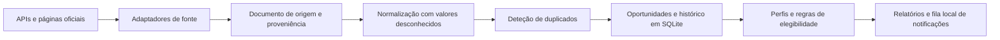

# CallBrief

**Inteligência de oportunidades de financiamento para PME e consultoras.**

CallBrief reúne avisos públicos, conserva a origem de cada facto e compara oportunidades com perfis separados de clientes. Esta versão demonstra um protótipo local com dados reais consultados em páginas oficiais, recuperação lexical, normalização explicável e armazenamento SQLite.

**Estado:** protótipo local em desenvolvimento. O registo tem quatro adaptadores oficiais ativos: a API Funding & Tenders, a API TED para contratação pública, a lista LIFE da CINEA e o XLSX do Plano Anual de Avisos Portugal 2030, que só fornece previsões. A amostra abaixo foi transcrita manualmente de páginas oficiais e não foi recolhida pelos adaptadores.

## O que demonstra

- 30 oportunidades reais, atuais ou recentes, de Portugal e de programas da União Europeia.
- 27 consultas de recuperação com rótulos de referência manuais, incluindo montantes, prazos e uma consulta sem resposta.
- Normalização de título, estado e prazo com proveniência para excertos e ligações oficiais.
- Deteção conservadora de duplicados por identificador ou ligação oficial; conserva variantes de fonte. Na amostra, os cinco pares CINEA/Funding & Tenders continuam por associar.
- Avaliações independentes para dois perfis fictícios e isolamento por espaço de trabalho e cliente.
- Regras de elegibilidade determinísticas, histórico de alterações e fila local de notificações.

## Fontes e dados

| Fonte | Cobertura | Adaptador | Reutilização comercial |
| --- | --- | --- | --- |
| [Funding & Tenders](https://ec.europa.eu/info/funding-tenders/opportunities/portal/screen/support/apis) | Subvenções e avisos de programas da UE | API JSON ativa | Condições específicas dos dados da API por confirmar |
| [TED](https://docs.ted.europa.eu/api/latest/search.html) | Contratação pública, não subvenções | API de pesquisa ativa | Reutilização documentada ([aviso legal](https://ted.europa.eu/en/legal-notice)), sujeita às regras de utilização adequada |
| [CINEA, avisos LIFE 2026](https://cinea.ec.europa.eu/life-calls-proposals-2026_en) | Títulos, prazos e ligações para avisos LIFE | Lista HTML ativa | Reutilização geral da Comissão com atribuição, salvo exceções e direitos de terceiros ([aviso legal](https://commission.europa.eu/legal-notice_en)) |
| [COMPETE 2030](https://compete2030.gov.pt/avisos/) | Avisos nacionais | Sem adaptador ativo | A reutilização automática aguarda esclarecimento dos termos |
| [Plano Anual de Avisos Portugal 2030](https://portugal2030.pt/plano-anual-de-avisos/) | Previsões de avisos futuros, nunca confirmação de abertura | Adaptador XLSX ativo, com campos selecionados e ligação à origem | Os termos do ficheiro exigem confirmação; redistribuição comercial desativada |

A API TED permite pesquisar avisos publicados e a documentação descreve utilização para análise e reutilização. A página da CINEA serve para descobrir prazos LIFE; a ligação para cada aviso completo aponta para o Funding & Tenders. A política geral da Comissão prevê reutilização com atribuição salvo indicação em contrário ou direitos de terceiros. Isso não confirma, por si só, as condições de cada dado devolvido pela API.

O [Plano Anual de Avisos](https://portugal2030.pt/plano-anual-de-avisos/) descreve o XLSX para consulta como aberto, pesquisável e editável. A página liga o [ficheiro XLSX do plano de setembro de 2026 a agosto de 2027](https://portugal2030.pt/wp-content/uploads/sites/3/2026/09/PlanoAnualAvisos_download_140926-1.xlsx), que serve tecnicamente como fonte canónica de previsões: contém identificadores, programas e datas previstas. Não confirma que um aviso esteja formalmente aberto. Não foi localizada uma licença específica para este ficheiro. Por isso, o adaptador conserva apenas campos selecionados e a ligação à origem; a redistribuição comercial continua desativada até a AD&C esclarecer as condições. Esta decisão sobre o ficheiro não altera a política aplicada ao conteúdo geral do portal.

Os termos gerais do [Portugal 2030](https://portugal2030.pt/termos-e-condicoes/) e do [COMPETE 2030](https://www.compete2030.gov.pt/termos-e-condicoes/) restringem a cópia e distribuição de conteúdo dos respetivos portais sem autorização, salvaguardadas as exceções legais, como o direito de citação com indicação da origem. Os avisos formalmente abertos continuam sem adaptador. O conjunto [PT2030 - Avisos no dados.gov.pt](https://dados.gov.pt/pt/datasets/dataset-pt2030-avisos) tinha, na consulta de 15/09/2026, licença não especificada e nenhum recurso de dados. O portal dispõe de uma API de catálogo, mas não foi encontrado nesse conjunto um recurso ou uma API específica para os avisos abertos, nem um fluxo RSS oficial. Os documentos anexos a avisos individuais podem ter condições próprias e ainda não foram recolhidos. Estas observações não constituem certificação jurídica.

Pergunta preparada para a AD&C: «Autorizam a recolha periódica dos identificadores, títulos, datas e ligações do ficheiro XLSX do Plano Anual de Avisos e dos avisos publicados, bem como a sua apresentação num serviço externo com atribuição e ligação à fonte? Existem licenças ou condições específicas para reutilizar os ficheiros descarregáveis?»

### Agent-Reach

CallBrief implementa `AgentReachSourceAdapter` atrás da interface `SourceAdapter` e recebe um serviço de recolha por injeção. Não foi encontrada uma instalação, ferramenta ou interface Agent-Reach utilizável neste ambiente. A ligação não foi executada; a aplicação não inclui código interno do Agent-Reach nem o apresenta como fonte de verdade.

### Amostra de oportunidades

O conjunto em `evals/real_opportunities.json` contém 30 registos consultados manualmente em fontes oficiais até 07/10/2026:

| Fonte | Registos |
| --- | ---: |
| COMPETE 2030 | 10 |
| Funding & Tenders | 15 |
| CINEA | 5 |

Na data de referência, a amostra contém 24 oportunidades abertas, uma futura e cinco encerradas nos últimos 90 dias. A página de `MPr-2026-6` ainda mostra 30/09/2026 numa secção, mas o [PDF oficial da republicação](https://compete2030.gov.pt/wp-content/uploads/2026/06/AVISOM3-1.pdf), datado de 30/09/2026, confirma 30/10/2026 como fim do período. O PDF limita a prorrogação indicada a candidatos com pedidos pendentes no MPr-2025-9. O registo guarda o excerto, a página do PDF e a ligação à fonte na evidência da oportunidade.

Os registos guardam ligações oficiais e excertos curtos. Não incluem respostas integrais das páginas nem resumos criptográficos dessas respostas. Os rótulos foram preparados numa só passagem e não tiveram validação independente por uma segunda pessoa. Assim, constituem um ponto de partida reproduzível, não uma avaliação humana independente.

## Fluxo de dados



O domínio depende de interfaces e não da base de dados ou da linha de comandos. Os adaptadores mantêm os detalhes de cada fonte fora das regras de negócio. O armazenamento comum conserva variantes por fonte, para que uma correspondência não apague a origem do registo.

## Início rápido

Requer Python 3.12 ou superior. A instalação básica não exige dependências externas.

```powershell
python -m venv .venv
.venv\Scripts\Activate.ps1
python -m pip install -e .
```

Ver o catálogo, verificar a ligação a uma fonte ou pesquisar avisos:

```powershell
callbrief source list
callbrief source check eu_funding_tenders --query "SME research" --limit 10
callbrief source check portugal2030_annual_plan --limit 10
callbrief discover --source eu_funding_tenders --query "SME research" --database callbrief.sqlite3
callbrief opportunity list --database callbrief.sqlite3
```

`source check` mostra o estado HTTP, os bytes recebidos, os registos aceites e rejeitados, a validação do esquema, o intervalo de datas, a última atualização e a paginação. Não guarda os dados. A disponibilidade externa não faz parte dos testes normais.

Criar um perfil e avaliar uma oportunidade guardada:

```powershell
callbrief organisation add `
  --database callbrief.sqlite3 `
  --workspace-id consultoria `
  --workspace-name "A minha consultora" `
  --id cliente-a `
  --name "Cliente A" `
  --country PT `
  --company-size PME

callbrief assess-opportunity `
  --database callbrief.sqlite3 `
  --workspace-id consultoria `
  --organisation-id cliente-a `
  --opportunity-id <ID_DO_AVISO> `
  --output avaliacao.html
```

O filtro `--region` compara a região da organização com as regiões elegíveis do aviso. O filtro `--geography` compara países ou outras geografias de candidatura. Os campos de perfil desconhecidos ficam vazios; as pontuações de adequação dependem de sinais fornecidos pelo utilizador ou pela configuração.

## Elegibilidade e adequação

A elegibilidade tem quatro estados:

- **Elegível:** as regras conhecidas e sustentadas por evidência foram cumpridas.
- **Inelegível:** falhou pelo menos uma regra obrigatória e determinística.
- **Remediável:** existe um requisito documentado que pode ser corrigido.
- **Incerto:** faltam dados do perfil, evidência ou regras normalizadas.

Cada regra guarda os identificadores das evidências e, quando aplicável, a medida corretiva. Sem evidência correspondente, uma regra não confirma elegibilidade. A inelegibilidade determinística torna a adequação geral «não aplicável».

A pontuação apresenta componentes de adequação estratégica, financiamento, esforço, prazo, capacidades, consórcio, maturidade e completude da evidência. Os pesos são configuráveis num ficheiro JSON. Componentes sem pontuação ficam fora da média. Sem pelo menos um sinal de adequação, o relatório não apresenta uma pontuação global; CallBrief não estima a probabilidade de sucesso sem dados validados.

Os tipos filtráveis incluem subvenções, incentivos reembolsáveis, empréstimos, garantias, incentivos fiscais, instrumentos financeiros, programas públicos e contratação pública.

## Dados, isolamento e relatórios

O SQLite guarda oportunidades comuns uma única vez, variantes por fonte, perfis por espaço de trabalho e avaliações por cliente. As consultas a perfis, avaliações e notificações de adequação incluem os identificadores do espaço de trabalho e da organização. Os avisos e as respetivas alterações são partilhados; uma notificação de adequação elevada pertence ao perfil avaliado.

Os relatórios incluem critérios, componentes, evidências e perguntas em aberto. O HTML escapa conteúdo não fiável, só aceita ligações HTTPS e não executa JavaScript. Os factos normalizados apontam para excertos, origem e localização. Na amostra atual, a ligação estrutural aos excertos foi verificada, mas não foi possível comparar os excertos com capturas integrais arquivadas.

O comando anterior `callbrief assess` continua disponível para avaliar documentos locais com um modelo compatível com Chat Completions. Por omissão, usa um serviço local. O envio para um serviço remoto exige `--allow-remote`; só seguem os excertos devolvidos pela pesquisa. O novo fluxo de avisos de financiamento não envia documentos a um modelo.

## Avaliação e resultados

O relatório reproduzível é gerado por `python -m evals.real_corpus_benchmark`. As medidas usam os 30 registos e 27 consultas do conjunto manual. As 26 consultas com resposta anotada cobrem atividade, geografia, tipo de candidato, consórcio, montantes, prazos e avisos semelhantes; uma consulta não tem resultado relevante na amostra.

| Medida | Resultado | Leitura |
| --- | ---: | --- |
| Adaptadores oficiais ativos no catálogo | 4 | Funding & Tenders, TED, CINEA e Plano Anual Portugal 2030; o Plano Anual só contém previsões |
| Verificações HTTP concluídas nesta máquina | 0 de 4 tentativas | As quatro fontes falharam antes de receber resposta; a disponibilidade em direto continua por confirmar |
| Registos reais na amostra manual | 30 | 10 COMPETE, 15 Funding & Tenders e 5 CINEA |
| Consultas de recuperação | 27 | 26 com resposta relevante e uma sem resposta |
| *Recall@5*, referência anterior | 1,00 | 26 consultas respondíveis |
| *Recall@5*, pesquisa atual | 1,00 | Sem melhoria face à referência neste conjunto |
| MRR@5, referência e pesquisa atual | 1,00 e 1,00 | Todos os relevantes surgiram em primeiro lugar neste conjunto |
| Falsos positivos na consulta sem resposta | 1 de 1, nos dois métodos | A pesquisa não se absteve |
| Tempo médio de pesquisa local | Referência: 1,03 ms; atual: 1,77 ms | Uma execução, 27 consultas e 30 registos em memória; exclui acesso às fontes |
| Normalização de título, estado e prazo | 85/85 corretos, 1,00 | Rótulos de referência de passagem única, sem segunda revisão |
| Citações estruturais | 85/85 excertos exatos, 1,00 | Sem resumos criptográficos das respostas oficiais arquivadas |
| Evidência da condição da prorrogação | 1/1 excerto ligado à oportunidade | Ligação e localização no PDF preservadas; o corpo e o resumo criptográfico não foram arquivados |
| Deduplicação entre CINEA e Funding & Tenders | 0 dos 5 pares positivos detetados; precisão não calculável | Zero previsões e zero falsos positivos; os registos CINEA não incluem o identificador encontrado na ligação oficial de espelho |
| Avaliação de dois clientes | 2 perfis, ambos «incerto» | A amostra não contém regras de elegibilidade completas |

As medidas de normalização, recuperação, citação e deduplicação não foram validadas por uma segunda pessoa. Os pares de duplicados mostram uma limitação concreta: o sistema não associa os avisos CINEA aos registos de Funding & Tenders sem um identificador comum. A consulta sem resposta também recebeu resultados e precisa de uma regra de abstenção. A avaliação do perfil não inventa critérios ausentes.

O conjunto sintético `evals/corpus/scenarios.json` continua a testar elegibilidade, fontes contraditórias, duplicados, alterações, recuperação, conteúdo malicioso e isolamento. Esses cenários não se confundem com os avisos reais. A suite local confirma os comportamentos cobertos pelos testes; não mede isolamento ou qualidade num serviço alojado.

### Alterações e notificações

A base de dados regista alterações materiais, incluindo mudança de prazo e de estado, e coloca eventos na fila local. Os testes verificam esses eventos com capturas controladas. A amostra real contém apenas um estado atual por aviso, por isso ainda não permite demonstrar alertas reais de abertura, encerramento, alteração de prazo ou adequação elevada. Não há envio por correio eletrónico ou mensagens.

### Enriquecimento de NIF

Não há fornecedor de enriquecimento ligado. O [Registo Comercial](https://registo.justica.gov.pt/Empresas/Publicacoes) permite pesquisar gratuitamente por NIPC e consultar informação pública, mas o serviço não documenta uma API de consulta em lote nem condições de reutilização comercial automática. A consulta de uma [certidão permanente](https://registo.justica.gov.pt/Empresas/Consultar-Certidao-Permanente) é gratuita quando já existe um código de acesso; pedir uma certidão de registo custa entre 25 € e 70 €, conforme a validade escolhida. O conjunto [Entidades do Portal Base, do IMPIC](https://dados.gov.pt/datasets/contratos-publicos-portal-base-impic-entidades/) tinha atualização semanal, com data de 04/10/2026, e ficheiros XLSX e JSON sob a classificação «Outra (Domínio Público)». Abrange apenas entidades registadas no Portal Base. Pode apoiar um fornecedor de âmbito limitado, depois de validar o esquema e as condições de reutilização; não constitui um registo geral de empresas. O [VIES](https://ec.europa.eu/taxation_customs/vies/) valida números de IVA intracomunitários, mas não fornece o perfil empresarial completo necessário para avaliar incentivos. O enriquecimento mantém-se como interface sem fornecedor até existir um âmbito e uma base de reutilização validados.

## Verificações locais

```powershell
python -m unittest discover -s tests -v
python -m compileall -q src tests evals
python evals/retrieval_benchmark.py
python -m evals.real_corpus_benchmark
```

O CI está configurado para Python 3.12, 3.13 e 3.14, além de formatação, análise estática e análise de tipos. Neste ambiente foi executado Python 3.14.6. Ruff e mypy não estão instalados localmente; a matriz e as verificações configuradas no CI dão cobertura adicional.

## Limites desta versão

- Os quatro adaptadores ativos não conseguiram obter resposta HTTP neste ambiente; a disponibilidade em direto continua por confirmar.
- A amostra de 30 registos foi compilada manualmente, não recolhida pelos adaptadores, e não inclui respostas integrais nem resumos criptográficos das páginas originais.
- A licença e as condições de reutilização comercial dos dados devolvidos pela API Funding & Tenders precisam de confirmação específica.
- A recolha dos avisos formalmente abertos do Portugal 2030 e do COMPETE aguarda uma fonte estruturada autorizada ou esclarecimento de reutilização. O adaptador do Plano Anual serve apenas previsões e mantém a redistribuição comercial desativada.
- Agent-Reach tem uma interface de adaptação preparada, sem ligação executável neste ambiente.
- A elegibilidade depende de regras normalizadas e de dados fornecidos pelo utilizador; não interpreta automaticamente documentos PDF ou páginas de avisos.
- O enriquecimento por NIF não tem fornecedor ligado.
- A fila de notificações é local e não envia mensagens externas.
- Não há interface gráfica, contas de utilizador, serviço alojado ou submissão automática de candidaturas.
