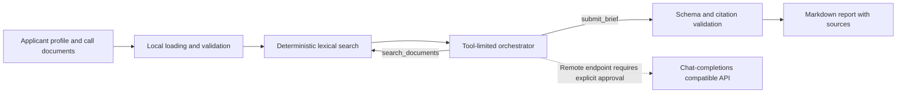

# CallBrief

**Evidence-cited screening of R&D funding calls.**

CallBrief searches local documents for a funding call and an applicant profile, then produces a structured summary of fit, requirements, deadlines, and open questions. Each factual finding points to source excerpts for review.

**Status:** Functional prototype with local search and model-assisted evaluation. It does not replace the official call text or a legal or funding decision.

## Why it exists

Innovation teams and consultants often compare long funding calls with information spread across several applicant documents. CallBrief makes the first review faster and easier to check. It separates what the documents support from what still needs human review.

## How it works



Documents are loaded and searched locally. The model receives only excerpts returned by search. By default, CallBrief uses a local server compatible with the chat-completions API. A remote HTTPS endpoint requires the explicit `--allow-remote` option.

## Engineering decisions

- **Search before answering:** the model must retrieve evidence before it can submit findings.
- **Limited tools:** it can search documents and submit a brief. It cannot run commands, access the network, or modify files.
- **Checked citations:** every citation must match evidence returned by search.
- **Deterministic controls:** code enforces file, size, argument, and turn limits.
- **No paid API calls in tests:** tests and evaluation scenarios use fake model clients.
- **Documents are data:** instructions inside a source document are never executed. Logs omit prompts, excerpts, and credentials.
- **Safe report writes:** an existing report is replaced only with `--force`; new output uses an atomic file replacement.

## Quick start

Requires Python 3.12 or later. The basic installation has no third-party runtime dependencies.

```bash
python -m venv .venv
# Linux or macOS
source .venv/bin/activate
# Windows PowerShell
.venv\Scripts\Activate.ps1
python -m pip install -e .
Copy-Item .env.example .env
```

Set `CALLBRIEF_MODEL` in `.env` and start a local model server that supports the chat-completions API. Then run:

```bash
callbrief assess --corpus examples/corpus --output assessment.md
```

For a remote service, configure `CALLBRIEF_BASE_URL`, `CALLBRIEF_MODEL`, and, when needed, `CALLBRIEF_API_KEY` in the environment or `.env`. Confirm that you can send the excerpts, then pass the explicit approval flag:

```bash
callbrief assess --corpus ./documents --output assessment.md --allow-remote
```

CallBrief supports Markdown and UTF-8 text files. To extract PDF text locally, install the optional dependency with `python -m pip install -e ".[pdf]"`.

## Document limits

Place the funding call and applicant profile in the directory passed to `--corpus`. The included example is fictional and does not represent a real call or applicant.

CallBrief accepts up to 250 files, limits each file to 5 MiB, and caps the corpus at two million characters. It ignores unsupported formats and environment or version-control directories.

## Tests and evaluation

Install development tools and optional PDF support:

```bash
python -m pip install -e ".[dev,pdf]"
```

Run the checks:

```bash
python -m unittest discover -s tests -v
python -m ruff format --check src tests
python -m ruff check src tests
python -m mypy src
python -m compileall -q src tests
```

The suite covers search and ranking, configuration validation, structured model calls, bounded retries after HTTP 429, tool allowlisting, citation checks, safe report writes, and two offline evaluations. GitHub Actions runs the same checks on Python 3.12, 3.13, and 3.14.

## Current limits

- Results depend on the source documents and configured model.
- Lexical search is deterministic, but it cannot retrieve concepts that use different wording. The project has no vector database or persistent memory.
- A “meets” finding means that the documents contain compatible evidence. A person must still interpret the official criteria.
- CallBrief is a CLI, not a hosted service or graphical application.
